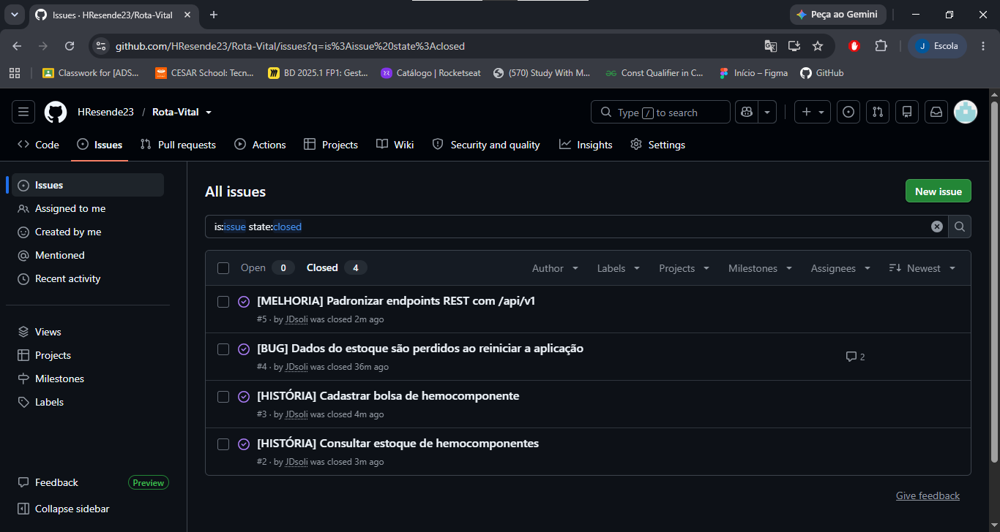

# 🩸 Rota Vital — Gestão e Distribuição de Hemocomponentes

O **Rota Vital** é uma aplicação web desenvolvida em **Java com Spring Boot** para apoiar o controle, a rastreabilidade e a distribuição de hemocomponentes entre hemocentros e unidades hospitalares.

O projeto busca reduzir desperdícios por vencimento, melhorar a visualização do estoque e apoiar o atendimento de solicitações hospitalares, especialmente em situações de urgência.

---

## 🚀 Funcionalidades planejadas

O escopo do projeto é dividido em sete histórias principais:

- **T01 — Estoque:** cadastro, consulta e controle de bolsas de hemocomponentes.
- **T02 — Requisição:** registro e acompanhamento de solicitações hospitalares.
- **T03 — Alocação:** regras de compatibilidade e reserva de bolsas.
- **T04 — Rota:** apoio à roteirização das entregas.
- **T05 — Monitoramento:** acompanhamento de temperatura durante o transporte.
- **T06 — Fracionamento:** rastreabilidade dos hemocomponentes derivados do sangue total.
- **T07 — Triagem:** quarentena, validação sorológica e liberação ou descarte de bolsas.

> As funcionalidades são implementadas progressivamente conforme as entregas da disciplina.

---

## 🛠️ Tecnologias utilizadas

### Backend
- Java
- Spring Boot
- Spring Web
- Spring Data JPA
- Hibernate
- Bean Validation
- Maven

### Banco de dados
- PostgreSQL

### Frontend
- HTML5
- CSS3

### Versionamento e gestão
- Git
- GitHub
- GitHub Issues / Bug Tracker

---

## 📁 Estrutura atual do projeto

```text
Rota-Vital/
├── src/
│   ├── main/
│   │   ├── java/br/com/rotavital/
│   │   │   ├── controller/
│   │   │   │   └── EstoqueController.java
│   │   │   ├── model/
│   │   │   │   ├── BolsaHemoComponente.java
│   │   │   │   ├── StatusBolsa.java
│   │   │   │   ├── TipoComponente.java
│   │   │   │   └── TipoSanguineo.java
│   │   │   ├── repository/
│   │   │   │   └── BolsaHemoComponenteRepository.java
│   │   │   ├── service/
│   │   │   │   └── EstoqueService.java
│   │   │   └── RotaVitalApplication.java
│   │   └── resources/
│   │       ├── static/
│   │       │   ├── index.html
│   │       │   ├── requisicao.html
│   │       │   ├── alocacao.html
│   │       │   ├── rota.html
│   │       │   └── monitoramento.html
│   │       └── application.properties
│   └── test/
├── pom.xml
├── mvnw
├── mvnw.cmd
└── README.md
```

---

## 🔌 Endpoints implementados

### Bolsas de hemocomponentes

| Método | Endpoint | Descrição |
|---|---|---|
| `GET` | `/api/v1/bolsas` | Lista as bolsas cadastradas no estoque |
| `POST` | `/api/v1/bolsas` | Cadastra uma nova bolsa de hemocomponente |

### Regras já implementadas

- Persistência de bolsas no PostgreSQL.
- Dados permanecem salvos após reiniciar a aplicação.
- Validação de campos obrigatórios.
- Validação da data de validade.
- Bloqueio de cadastro com código de bolsa duplicado.
- Padronização REST com prefixo `/api/v1`.

---

# 📦 Entregas

## 🚀 Entrega 01 — Definição e Prototipagem

Nesta etapa foi definido o escopo inicial do Rota Vital por meio das histórias de usuário e da prototipagem das principais telas do sistema.

### 🩸 T01 — Estoque
Gestão da entrada, classificação, validade e disponibilidade de bolsas de hemocomponentes.

### 📥 T02 — Requisição
Registro e priorização de demandas hospitalares.

### 🧠 T03 — Alocação
Aplicação de regras de compatibilidade e reserva de hemocomponentes.

### 🗺️ T04 — Rota
Planejamento de deslocamento entre hemocentro e hospitais.

### ❄️ T05 — Monitoramento
Acompanhamento das condições de temperatura durante o transporte.

### 🎒 T06 — Fracionamento
Controle dos derivados obtidos a partir de uma bolsa de sangue total.

### 🏷️ T07 — Triagem e Validação Sorológica
Controle de quarentena, resultados de exames, liberação e descarte.

### 🎨 Protótipo no Figma
🔗 [Rota Vital — Entrega 01](https://www.figma.com/design/CZ4BYx3COy4SKGpxZ36Zu1/Rota-Vital-%E2%80%94-Entrega-01?node-id=0-1&p=f&t=bXHbJWjJVn23hN8B-0)

---

## ✅ Entrega 02 — Implementação inicial

Nesta entrega foram implementadas as duas primeiras funcionalidades do módulo de estoque, além da persistência em banco de dados e do uso do Issue/Bug Tracker do GitHub.

### 🟨 História implementada 01 — Consultar estoque

> **Como** responsável pelo estoque  
> **Quero** visualizar as bolsas de hemocomponentes cadastradas  
> **Para** acompanhar a disponibilidade do estoque.

**Valor entregue:** o sistema consulta as bolsas persistidas no banco por meio do endpoint:

```http
GET /api/v1/bolsas
```

**Critérios atendidos:**
- listagem das bolsas cadastradas;
- exibição do código;
- tipo sanguíneo;
- tipo de hemocomponente;
- validade;
- status;
- consulta persistente mesmo após reiniciar a aplicação.

---

### 🟨 História implementada 02 — Cadastrar bolsa de hemocomponente

> **Como** responsável pelo estoque  
> **Quero** cadastrar uma nova bolsa de hemocomponente  
> **Para** manter o estoque do sistema atualizado.

**Valor entregue:** o sistema permite cadastrar bolsas e armazená-las no PostgreSQL por meio do endpoint:

```http
POST /api/v1/bolsas
```

**Critérios atendidos:**
- cadastro de uma nova bolsa;
- persistência em PostgreSQL;
- validação de campos obrigatórios;
- validação da data de validade;
- bloqueio de código duplicado;
- retorno de erro HTTP `400` em cadastros inválidos;
- retorno HTTP `201 Created` em cadastros válidos.

---

## 🐛 Issue / Bug Tracker

Durante a Entrega 02 foi utilizado o **GitHub Issues** para registrar histórias, bugs e melhorias do projeto.

Issues trabalhadas:

- `#2` — **[HISTÓRIA] Consultar estoque de hemocomponentes**
- `#3` — **[HISTÓRIA] Cadastrar bolsa de hemocomponente**
- `#4` — **[BUG] Dados do estoque são perdidos ao reiniciar a aplicação**
- `#5` — **[MELHORIA] Padronizar endpoints REST com /api/v1**

As quatro issues foram utilizadas durante o desenvolvimento e encerradas após a validação das respectivas implementações.

### Evidência do Issue/Bug Tracker



---

## 🎥 Screencasts da Entrega 02

> Adicionar os links do YouTube após a gravação.

- **Demonstração do sistema funcionando:** `LINK_AQUI`
- **Explicação do código Spring Boot e das histórias implementadas:** `LINK_AQUI`

---

## ▶️ Como executar o projeto

### Pré-requisitos

Antes de iniciar, instale:

- Java 17 ou superior
- Maven
- PostgreSQL
- Git

### 1. Clonar o repositório

```bash
git clone https://github.com/HResende23/Rota-Vital.git
cd Rota-Vital
```

### 2. Criar o banco de dados

No PostgreSQL, crie um banco chamado:

```text
rotavital
```

### 3. Configurar a senha do banco

O projeto utiliza a variável de ambiente `DB_PASSWORD`.

No PowerShell:

```powershell
$env:DB_PASSWORD="SUA_SENHA_DO_POSTGRES"
```

### 4. Iniciar a aplicação

```bash
mvn spring-boot:run
```

A aplicação será executada em:

```text
http://localhost:8080
```

### 5. Consultar o estoque

```text
http://localhost:8080/api/v1/bolsas
```

---

## 🧪 Exemplo de cadastro de bolsa

Exemplo de JSON:

```json
{
  "codigo": "B001",
  "componente": "CONCENTRADO_HEMACIAS",
  "tipoSanguineo": "A_POSITIVO",
  "validade": "2026-10-20",
  "status": "DISPONIVEL"
}
```

Endpoint:

```http
POST /api/v1/bolsas
```

---

## 👥 Integrantes

| Integrante |
|---|
| Hilton Resende Montes Neto |
| Jardel Simplicio de Oliveira Junior |
| Dayanne Cristina Moraes Inacio |
| Rodrigo Cavalcanti Albuquerque Rodrigues dos Santos |

---

## 📌 Observação

O Rota Vital está em desenvolvimento incremental. As demais histórias previstas no escopo serão implementadas nas próximas entregas.
